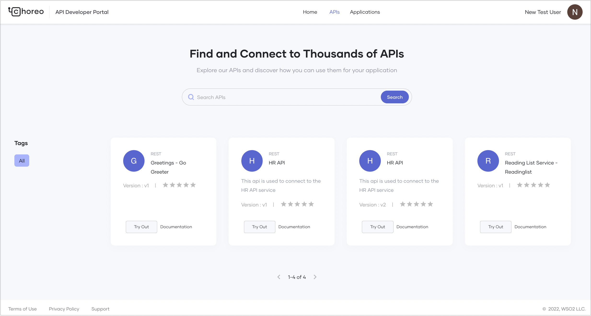

# Consume an API Key Secured Service

## Overview

Choreo is a powerful platform that enables developers to create, deploy, and consume services efficiently. The Choreo Developer Portal simplifies API discovery and usage, allowing developers to integrate APIs seamlessly into their applications.

This guide is intended for application developers (both internal and external) who wish to consume APIs published in the Developer Portal to build their applications. You will learn how to:

- Discover APIs
- Create an application and generate credentials
- Subscribe to an API
- Consume a published REST API via a web application

---

## Prerequisites

Before proceeding, ensure you have access to a published service to consume. If you do not have one, follow the [Develop a Service](../develop-components/develop-services/develop-a-service.md) guide to create and deploy a sample REST API.

---

## Discover APIs

In the Choreo Developer Portal, developers can search for APIs by name. APIs and services created and published through the Choreo Console are visible in the Developer Portal based on their visibility settings:

- **Public**: Visible to all users in the Developer Portal.
- **Private**: Accessible only to signed-in users.
- **Restricted**: Available to users with specific roles, enabling granular access control.

For more details, refer to [Control API Visibility](../api-management/control-api-visibility.md).

### Viewing Available APIs

The Developer Portal lists APIs categorized by their major versions. The API overview page displays:

- Subscribed versions of the API
- Subscription details (e.g., application name and creation date)

### Selecting the Correct API Version

> **Tip:** It is recommended to use the latest version of an API. Copy the **Endpoint(s)** from the API overview page and integrate it into your client application to ensure compatibility with the most recent updates.

---

## Creating an API Key

To consume an API secured with an API Key, an API Key is required. To obtain an API Key, an application must first be created in the Choreo Developer Portal. This application represents a physical entity (such as a mobile app, web app, or device) and serves as the means to subscribe to APIs under a defined usage policy. The API Key is associated with a specific application, and an application can be created during the API Key generation process if needed.

---

### Steps to Create an API Key

1. Navigate to the [Choreo Developer Portal](https://devportal.choreo.dev) and sign in.
2. Click on **APIs** in the Developer Portal header.
3. Select the desired API that requires an API Key for access.
4. This will take you to the API overview page, where you can manage credentials.

#### Generating Environment-Specific API Keys.

Choreo allows you to generate API keys for production and non-production environments.

!!! note
    Access to production endpoints may be restricted based on your user role. Ensure you have the required permissions before generating production keys.

Follow these steps to generate an API Key:

1. In the left navigation menu, select the desired environment under **Credentials**. The **API Keys** pane for the chosen environment will open.
2. If any API keys already exist, they will be listed here.
3. Click **Generate API Key** and configure the following options:
    - **Key Name**: Provide a suitable name for the API key.
    - **Environment**: Choose an environment (if multiple environments are configured for the API).
    - **Application**: Select an existing application or create a new one.
    - **Subscription Policy**: Choose an appropriate subscription policy.
4. Click **Generate**. The newly created API Key will be displayed.

!!! note
    If the selected application is already subscribed to the chosen API, the subscription selection step will be skipped.

Use this API Key to authenticate API requests by including it in the `api-key` header when invoking the API.
