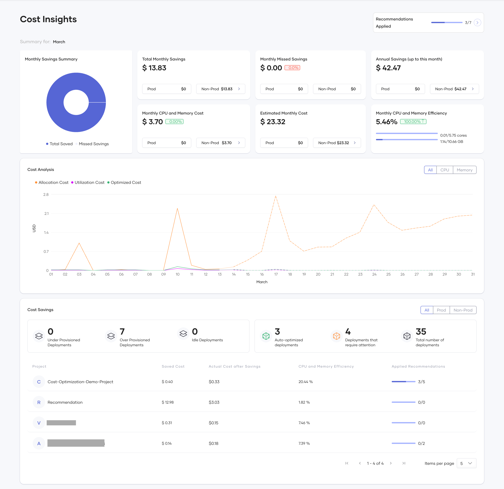
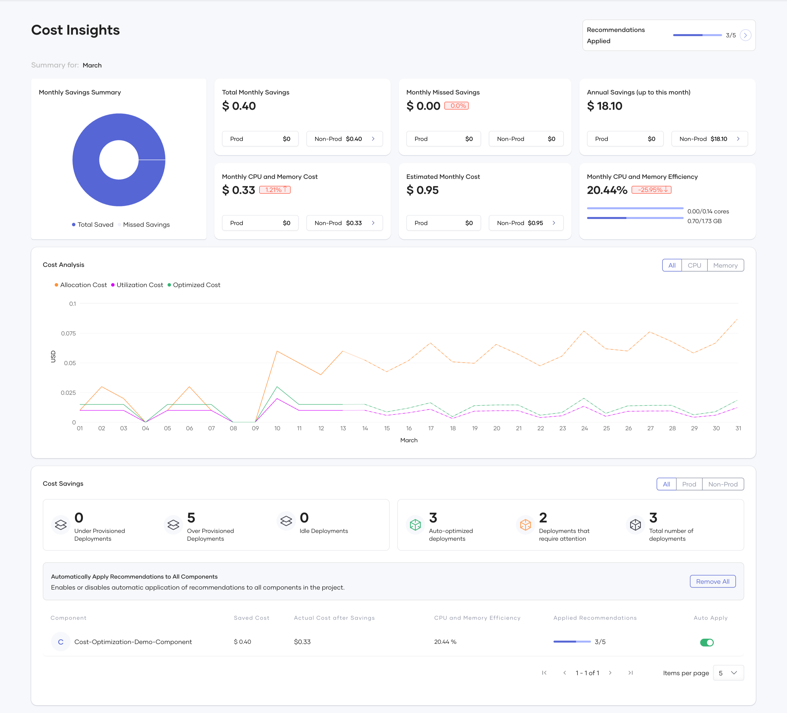
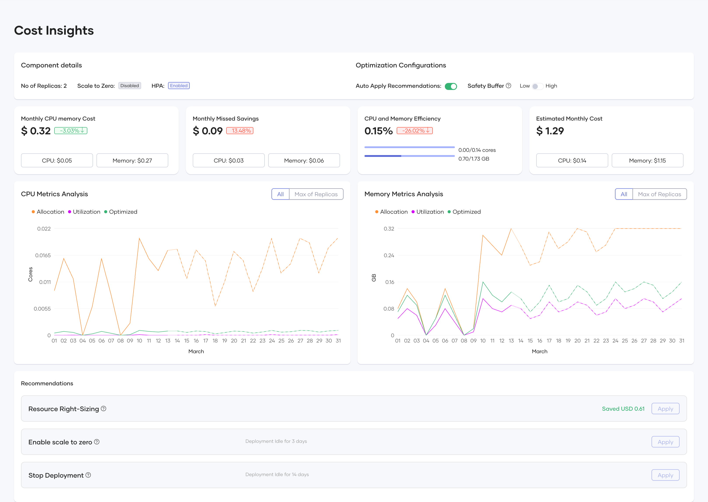

# Choreo Cost Optimization

## Overview

The Choreo cost optimization feature provides detailed cost insights across your organization, enabling you to analyze resource utilization and cost efficiency at the Organization, Project, and Component levels. The dashboards provide comprehensive visualizations and actionable recommendations to optimize cloud infrastructure costs while maintaining performance.

**All metrics, visualizations, and analytics displayed across the Organization, Project, and Component levels reflect data for the current month, from the first day up to the current date.** This provides you with up-to-date insights into your resource utilization and cost efficiency.
Monthly figures show the accumulated data for the current month so far, while comparisons to previous month are also available in some metrics. This approach gives you both immediate visibility into current spending patterns and understanding the trend compared to last month for optimization decisions.

You can use this information to track ongoing cost optimization efforts and make timely adjustments to your resource allocations within the current billing cycle.

## Organization Level

At the Organization level, Choreo provides key insights into overall cost savings and resource efficiency across all your projects. You can view the following metrics and visualizations:

* **Monthly Savings Summary**

  

  This chart visualizes the percentage of cost savings achieved (by manual or automatic application of recommendations) compared to missed savings (potential savings missed due to recommendations not being applied) up to the current date. You should aim to maximize the saved cost and minimize missed savings.

* **Total Monthly Savings**

  

  This card shows the cost saved in the current month through manual or automatic application of recommendations. It includes a breakdown for Production and Non-Production environments, with a dropdown showing savings for each respective environment.

* **Monthly Missed Savings**

  

  This card displays the potential cost savings that were missed due to the failure to apply recommendations, whether manually or automatically. It provides a breakdown of these missed savings for both production and non-production environments, listing values for each individual environment. It is recommended to keep these missed savings as minimal as possible.

* **Annual Savings**

    

  This card shows accumulated savings throughout the year. It combines the savings completed through the end of the previous month with savings achieved up to the present day of the current month. This demonstrates that a fully cost-optimized organization with no savings for the current month has achieved this state by saving costs in previous months.

* **Monthly CPU and Memory Cost**

  

  This card shows the cost incurred for CPU and Memory allocation across all components in your organization. It includes a percentage change compared to the previous month to indicate cost trends.

* **Estimated Monthly Cost**

  

  This card shows the forecasted cost at the end of the month, with an environmental breakdown, regardless of which day of the month you view it.

* **Monthly CPU and Memory Efficiency**

  

  This card shows the percentage utilization of CPU and Memory compared to allocation. This metric indicates your resource optimization level, which directly reflects cost optimization. The breakdown of CPU and Memory efficiencies provides individual understanding of each resource's optimization. The percentage change shown compares current efficiency to last month's efficiency with an arrow indicating increase or decrease.

* **Cost Analysis Plot**

   

  The plot consists of three lines:

  * **Allocation Cost** - The maximum of Request Cost and Utilization Cost at a given point in time. This is what you're billed for CPU and memory resource costs.
  * **Utilization Cost** - The ideal cost that should be billed if no extra resources were allocated. This is typically not achievable in practice as some buffer is needed for uninterrupted service.
  * **Optimized Cost** - The cost suggested by the optimization algorithm that provides sufficient buffer for efficient performance while optimizing costs.

  You can filter the view to show All resources, CPU only, or Memory only for time-based cost analysis.

* **Cost Savings (Deployments Summary)**

  

  Under the Cost Savings section, these cards provide a summary of all deployments in your organization:

  * **Under Provisioned Deployments** - Number of deployments with insufficient resource allocation
  * **Over Provisioned Deployments** - Number of deployments with over-allocated resources
  * **Idle Deployments** - Deployments with no traffic for the last 3 days
  * **Auto-optimized deployments** - Number of deployments with auto-optimization enabled
  * **Deployments that require attention** - Number of deployments with auto-optimization disabled that have recommendations for manual application
  * **Total number of deployments** - Number of active deployments

* **Cost Savings (Project Summary)**

  

  This table under the Cost Savings section includes a summary of all projects in your organization. Each row represents a project with columns showing:
  * Saved Cost after applying recommendations automatically/manually
  * Actual Cost after Savings
  * CPU and Memory Efficiency 
  * Ratio of Applied Suggestions to total available recommendations

  You can click on any project in this table or use the top navigation to visit the Project Level cost insights.

## Project Level

The Project Level view is similar to the Organization Level, with all monthly metrics focused on the selected project. The charts, cards, plots, and tables follow the same format as the Organization Level.

An additional feature at this level is the ability to toggle auto-apply for each component in the Cost Savings (Component Summary) table, or for all components. This simplifies the process of enabling auto-application of recommendations across all components in a project.

 

These toggles enable automatic application of recommendations for all deployments in the selected components.

## Component Level

The Component Level differs from both Organization and Project levels. At the Component Level, you can access the release level through both deployment track (version) and environment configuration as shown:

 

At the Release Level within the Component Level, you can view:

* **Component details and Optimization Configurations**

   

  This card shows configuration data for the deployment, including number of replicas, scale to zero settings, and horizontal pod auto-scaling that can be configured in DevOps.

  #### Optimization Configurations
    Under the Optimization Configurations section, you can configure how Choreo applies cost optimization recommendations:

    Auto Apply Recommendations: 
    
    When enabled, this toggle automatically implements resource right-sizing recommendations daily. Every 24 hours the system automatically checks if the release has any recommendations that would save more than $0.01, and if found, applies them without requiring manual intervention. This feature helps maintain continuous cost efficiency without constant monitoring.

    Safety Buffer: 
    
    This setting determines how conservatively the optimization algorithm calculates resource recommendations:

        Low: Adds a 10% buffer above the calculated resource requirements, which maximizes cost savings but provides less headroom for unexpected traffic spikes

        High: Adds a 20% buffer above the calculated resource requirements, offering more capacity for handling unexpected load increases - recommended for production environments

    The Safety Buffer setting helps you balance between maximum cost efficiency and maintaining reliable performance. For mission-critical applications or services with variable workloads, the High setting provides additional capacity to handle sudden traffic increases, while the Low setting is suitable for predictable workloads where you want to optimize costs more aggressively.
    These configurations allow you to tailor the optimization behavior to your specific needs, balancing cost-saving opportunities with operational requirements at the component level.

* **Monthly Cost, Missed Savings, Efficiency and Estimated Cost**

  

  These cards summarize the cost and resource metrics similar to those at the Organization and Project levels.

* **CPU Metrics Analysis**

  

* **Memory Metrics Analysis**

  

* **Recommendations**

  

  The system provides **automated** and **manual** recommendations for cost reduction.

### Optimization Types

* **Resource Right-Sizing**
  * Suggests optimized CPU and memory limits
  * Provides potential cost savings per adjustment

* **Enable Scale to Zero**
  * Stops a component when no requests are being served
  * Reduces idle infrastructure costs

* **Stop Deployment**
  * Identifies and halts unused deployments
  * Prevents unnecessary spending on unused resources

### Applying Recommendations

* **Manually Apply**: You can review and apply suggestions individually
* **Auto-Apply Toggle**: Enables automatic cost optimizations for projects/components

## Conclusion

The Choreo Cost Optimization feature helps you improve cloud resource efficiency by providing insights and recommendations at various levels. With interactive visualizations, automated recommendations, and optimization tracking, you can reduce infrastructure costs while maintaining performance.
