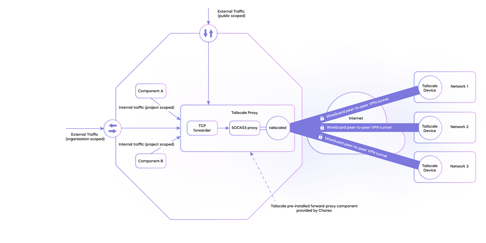
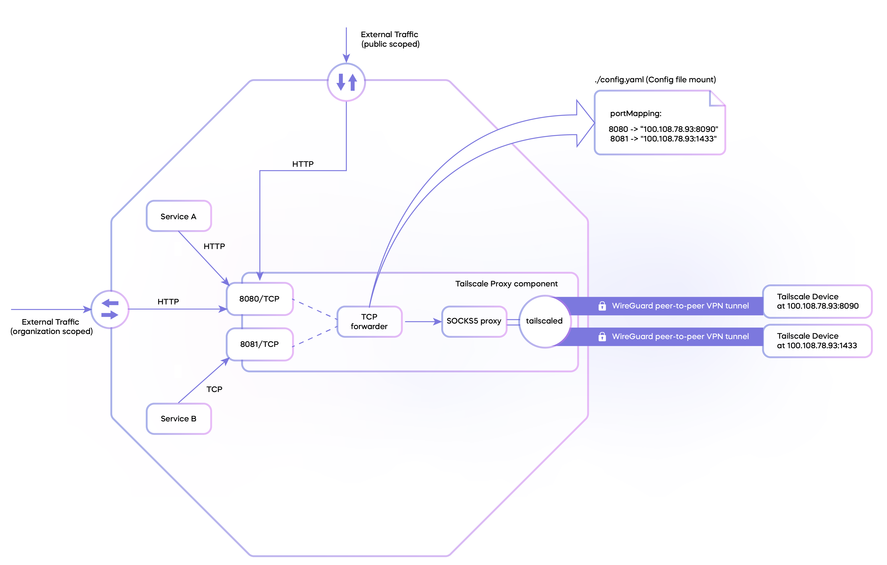

# Configure VPNs on the Choreo Cloud Data Plane

Secure access to private networks from the Choreo cloud data plane is an essential use case for cloud data plane users. 

Choreo allows this secure connection using [Tailscale](https://tailscale.com/). For this, Choreo provides a prebuilt Tailscale image component that can act as a forward proxy, which you can deploy in your Choreo project as a service. This service allows you to forward traffic to your external networks via Tailscale’s peer-to-peer [WireGuard](https://tailscale.com/kb/1035/wireguard) network.

The following diagram illustrates the high-level deployment architecture of the Tailscale pre-installed forward proxy:



Let's take a look at the specifics of each part to understand the deployment architecture.

- **Choreo project**

    In Choreo, a project groups various components. For more information on what a project in Choreo is, see the documentation on [Project](../choreo-concepts/project.md).

- **Tailscale proxy**

    This acts as the Tailscale pre-installed forward proxy, facilitating secure peer-to-peer WireGuard connections from the Choreo cloud data plane to private networks. It includes a [Tailscale Daemon](https://tailscale.com/kb/1278/tailscaled), [SOCKS5 proxy](https://tailscale.com/kb/1112/userspace-networking#socks5-vs-http), and a configurable TCP forwarder.

    - **Tailscale daemon**

        This is the core component of Tailscale. It is a software service that provides secure network connectivity and private networking solutions. For more details see the [Tailscale documentation](https://tailscale.com/kb/1278/tailscaled).

    - **SOCKS5 proxy**

        This uses Tailscale’s [userspace networking](https://tailscale.com/kb/1112/userspace-networking) mode, rather than the kernel mode. Therefore, the inbuilt SOCKS5 proxy handles the forwarded traffic and directs it through the Tailscale network.

    - **TCP forwarder**

        Forwards inbound TCP (transmission control protocol) traffic from the Tailscale proxy container’s network interface to the SOCKS5 proxy, ensuring it reaches its destination via the secured WireGuard tunnel.

- **User applications and the Choreo API gateway**

    User applications within the same namespace (project) can use the Kubernetes service created to front the Tailscale proxy, for connecting to the corresponding private endpoints. You can either expose this service within the organization via the internal API gateway or expose it to the public via the external API gateway.

<hr>

Now that you understand the deployment architecture, let’s explore how you can use Tailscale to secure connections to your private networks.

## Configure and use Tailscale to access private network endpoints

This section walks you through the steps to create, configure, deploy, and use the Tailscale proxy component. 



Let's get started.

### Prerequisites

- Understand the basics of [how Tailscale works](https://tailscale.com/blog/how-tailscale-works).
- Have a Tailscale account (Tailnet). There are multiple plans available for you to set up your Tailscale network. For details, see [Tailscale plans](https://tailscale.com/pricing).
- Install Tailscale and connect your private data center or server to it, so that your private services are accessible via your Tailscale network. To quickly get started with Tailscale, see the [Tailscale quickstart](https://tailscale.com/kb/1017/install).

### Step 1: Create the Tailscale proxy component

!!! Note -
    Component creation is not available for the **Platform Engineer** role. Switch to the **Developer** perspective to create a component.

1.  Sign in to the [Choreo Console](https://console.choreo.dev/).
2.  In the Choreo Console top navigation menu, select the **Organization**, and then the **Project**.
3.  On the project home page, click **+ Create**, and select the **Service** card to create a service component.
4. Click the **Container Registry** from the **Connect a Docker Image** section
5. In the **Container Registry** list, select **Choreo Samples Registry**.
6. Click the **Tailscale Proxy** card.
7. Enter a display name, component name, and a description for the service. For this guide, let's enter the following values:

    |Field                 |     Value                |
    |----------------------|--------------------------|
    |Component Display Name| Tailscale proxy          |
    |Component Name        | tailscale-proxy          |
    |Description           | Tailscale proxy component|

8. Click **Create**.

Now you have successfully created the Tailscale proxy. You can proceed to configure and deploy it.

### Step 2: Configure and deploy the Tailscale proxy

Here, you will add the required volume mounts, set the Tailscale authentication key, configure the TCP forwarder, configure endpoints, and deploy the Tailscale proxy. Follow the steps given below:

#### Step 2.1: Add required volume mounts

Tailscale requires the following volume mounts for its operations:

 - `/var/run/tailscale`
 - `/.local`

To create the volume mounts, follow the step-by-step instructions in [Configure Storage](../k8s-operations/storage/configure-storage.md). 

#### Step 2.2: Configure and deploy the component

To configure and deploy the component, follow the steps given below:

1. In the left navigation menu, click **CI Pipelines**.
2. On the **Setup** card, click **Configure &  Deploy**.
3. In the **Environment Configurations** pane that opens, click **+ Add** and add the `TS_AUTH_KEY` environment variable as a secret. To add the environment variable, you must obtain an authentication key from your Tailscale network. For details on how to obtain an authentication key from your Tailscale network, see [Auth keys](https://tailscale.com/kb/1085/auth-keys) in the Tailscale documentation.

    !!! info "Note"
        The authentication keys obtained from your Tailscale network have an expiration date and require periodic rotation. To avoid manual rotation, you can generate non-expiring authentication keys using OAuth clients. For details, see [Generating long-lived auth keys](https://tailscale.com/kb/1215/oauth-clients#generating-long-lived-auth-keys) in the Tailscale documentation.

        Follow these steps if you want to add an OAuth client secret to the Tailscale proxy component instead of the `TS_AUTH_KEY` environment variable as a secret:

         1. Define a tag named `choreo-vpn` in your Tailscale ACLs. For details, see [Define a tag](https://tailscale.com/kb/1068/tags#define-a-tag) in the Tailscale documentation.
         2. Create an [OAuth client](https://tailscale.com/kb/1215/oauth-clients) with the following scope, ensuring it is assigned to the `choreo-vpn` tag:
             - Keys → Auth Keys → write
         3. Generate the OAuth client and copy the client secret.
         4. Set the client secret as an environment variable named `OAUTH_CLIENT_SECRET`.

4. Click **Next**.
5. In the **File Mount** pane that opens, click **+ Add**.
6. To mount a configuration file to the Tailscale proxy component and specify the port mapping for the TCP forward proxy running there, do the following:
    1. Specify `/config.yaml` as the **Mount Path**.
    2. Specify the following in the sample configuration file:
       ```
       portMappings:
           8080: "100.108.78.93:8090"
           8081: "100.108.78.93:1433"
       ```
    !!! note
            In this sample configuration, the TCP traffic arriving at port 8080 on your Tailscale proxy will be forwarded to port 8090 on the node with IP address 100.108.78.93 in your Tailscale network. Similarly, port 8081 will map to the corresponding address. You can find the IP addresses of your nodes on the [Tailscale machines](https://login.tailscale.com/admin/machines) page in your Tailscale network's admin console or via the Tailscale clients running on your machine.
7. Click **Next**.
8. In the **Endpoints** pane that opens, click **+ Add** and edit the `endpoints.yaml` configuration to expose your Tailscale proxy as a service. The following is a sample `endpoints.yaml` configuration you can use:

!!! note
        The sample `endpoints.yaml` file given below defines two project-level endpoints. These endpoints can be used by other components within the same project to access the services. If you want to directly expose your private endpoint via the Choreo gateway either with the **Public** or **Organization** visibility, you can set the `networkVisibility` property of the endpoint to `Public` or `Organization`.
    ``` yaml
    version: 0.1
    endpoints:
      - name: Private HTTP service
        port: 8080
        type: REST
        networkVisibility: Project
        context: /
      - name: Private DB service
        port: 8081
        type: TCP
        networkVisibility: Project
        context: /
    ```
9. Click **Save**.
10. Click **Next** and then click **Deploy**.
    
!!! note
        Deploying the component may take a while. You can track the progress by observing the logs. Once the deployment is complete, the build status changes to **Active** on the **Development** environment card.
When the component is deployed, you can observe a new node connected to your Tailscale network. To view this, go to the [Tailscale machines](https://login.tailscale.com/admin/machines) page of your Tailscale coordination server.

### Step 3: Access private network endpoints with the Tailscale proxy
Now you have successfully deployed the Tailscale proxy in your project and it is connected to your Tailnet. You can proceed to use the Tailscale proxy to provision access for other components to securely access private network endpoints.
You can [configure endpoints](https://wso2.com/choreo/docs/develop-components/configure-endpoints/#learn-the-endpointsyaml-file) of the Tailscale proxy to use it for various aspects within Choreo.

## Post-deployment actions

### Handle node key expiry

Tailscale nodes have a default [node key](https://tailscale.com/kb/1010/node-keys) expiry time of 180 days. Nodes require re-authentication after key expiry to avoid connection losses and application downtime. There is an option to disable node key expiry if necessary. For more details, see [Node key expiry documentation](https://tailscale.com/kb/1028/key-expiry).

### Handle auth key expiry

[Auth keys](https://tailscale.com/kb/1085/auth-keys) are used to register new nodes into your Tailscale network. The default [expiry time for auth keys](https://tailscale.com/kb/1085/auth-keys#key-expiry) is 90 days, but nodes remain connected even after auth key expiry. This becomes an issue only if the Tailscale Proxy component is redeployed or restarted.

### Update port mapping configurations

If you want to add a new private endpoint to your network and access it via the same Tailscale proxy within Choreo, you must add a new port mapping entry in the port mapping configuration of your Tailscale proxy deployment.

## Best practices

### Configure health checks

Since the Tailscale proxy acts as a forward proxy, it is important to configure health checks. You can use one of the open ports of the TCP forwarder as a health endpoint. For details on how to set up health probes in Choreo, see [Set up health checks](../k8s-operations/set-up-health-checks.md).

### Use Tailscale ACLs

You can use [Tailscale ACLs](https://tailscale.com/kb/1018/acls) to precisely manage permission for users and devices on your Tailnet.

### Disable scale-to-zero for the Tailscale proxy

It is recommended to disable [Scale-to-Zero](../k8s-operations/scaling/autoscale-components-with-scale-to-zero.md) for the Tailscale proxy because it acts as a forward proxy and should always be up and running to make consistent connections with the Tailscale VPN mesh.
If you enable Scale-to-Zero, you may experience service downtime.

### Run multiple replicas with HPA (horizontal pod autoscaler) 

To achieve high availability and resiliency for the Tailscale proxy, you must run multiple replicas with HPA. To configure multiple replicas for the Tailscale proxy component, go to the **Scaling** page under **DevOps**. For more details, see [Autoscale component replicas](../k8s-operations/scaling/autoscale-component-replicas.md)

## Security best practices

Before deploying the Tailscale proxy in production environments, it is recommended to follow the Tailscale [production best practices](https://tailscale.com/kb/1300/production-best-practices) and [security best practices](https://tailscale.com/kb/1196/security-hardening).
!!! Note
     Choreo blocks incoming connections from other nodes in your Tailnet to the Tailscale proxy to prevent access to your project’s namespace in the Choreo cloud data plane. 

## Troubleshoot issues

For assistance in resolving common Tailscale proxy issues, see [Troubleshoot Tailscale proxy issues](../references/troubleshoot-choreo.md#troubleshoot-tailscale-proxy-issues).