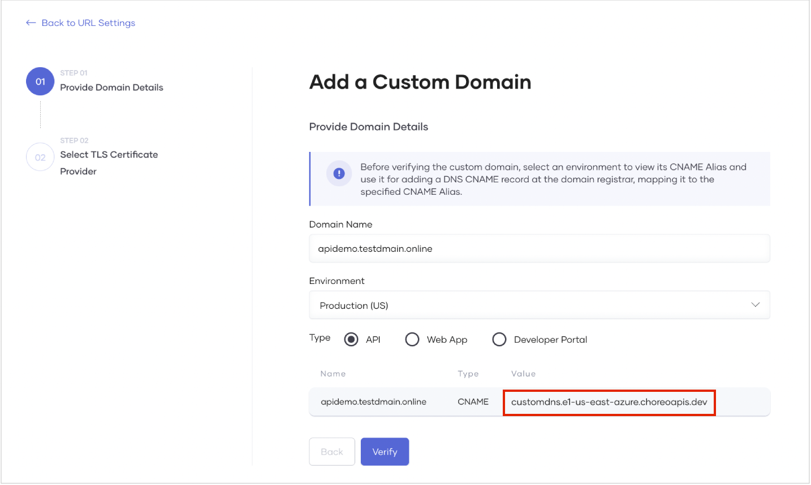
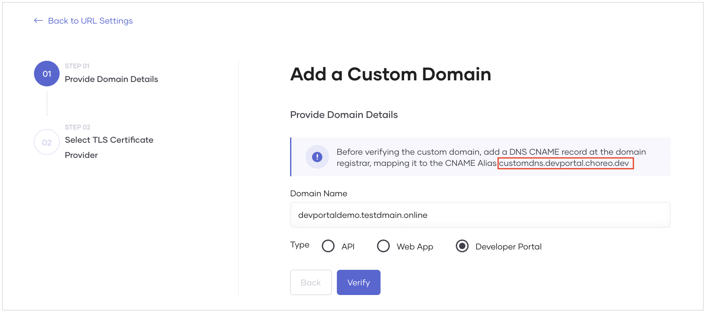
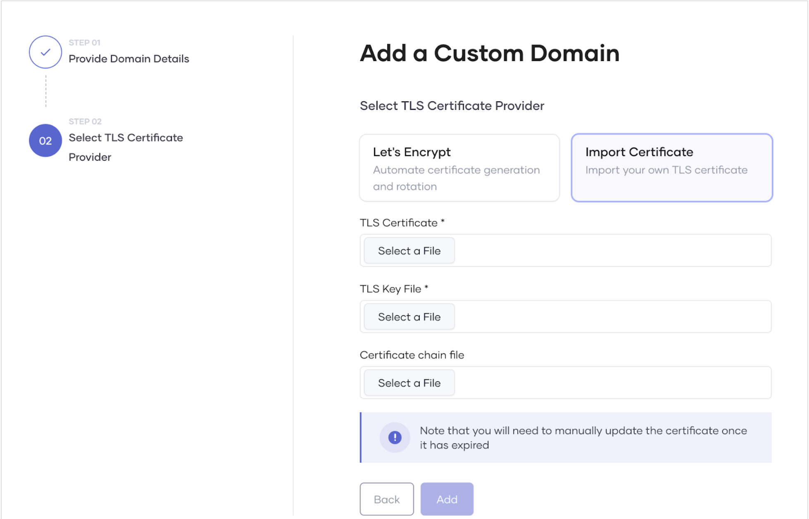
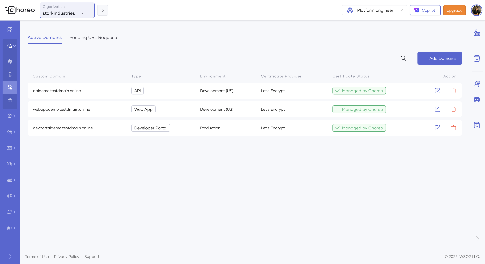

# Configure a Custom Domain for Your Organization

A custom domain is essential for effective branding, discoverability, and credibility of a website. Choreo allows you to easily configure custom domains for your organization, enabling developers to utilize it to configure custom URLs for their components such as API proxies, services, web applications, and webhooks.

This section provides an overview of Choreo’s custom domain configuration model and guides you through configuring a custom domain for your organization.

## Choreo custom domain configuration model

Choreo allows platform engineers to add custom domains for their organizations. When an platform engineer adds custom domains to an organization, component developers can utilize the custom domains for their respective components.

## Configure a custom domain for an organization

To add a custom domain for your organization, follow the steps given below:

!!! info "Note"
     To add a custom domain, you must have **Manage Custom Domains** permission under **URL Management** permission group.

1.  Sign in to the [Choreo Console](https://console.choreo.dev/).
2.  In the top navigation menu, click the **Organization** list and select your organization.
3.  In the left navigation menu, click **Infrastructure** and then click **Domains**.
4.  Click the **Active Domains** tab.
5.  Click **+ Add Domains**.
6.  In the **Add a Custom Domain** pane, do the following:

    1.  Enter your domain name.
    2.  Select the environment to apply the domain name.
    3.  Select the entity type to apply the domain name.

        !!! tip
            In this context:

            - The **API** entity type represents Choreo components exposed via an endpoint, including API Proxy, Service, and Webhook components.
            - The **Web App** entity type represents the Web Application component.

7.  Take a look at the generated CNAME target value displayed and create a DNS record associating the domain name to the CNAME target value with your DNS provider.

    

    !!! info
        When you select **Developer Portal** as the type, the environment is not applicable, and the CNAME alias will be displayed as follows:
    

8.  Once the CNAME type DNS record is created, click **Verify**.

    !!! info "Note"
            If the CNAME mapping is correct, the verification completes successfully. It can take some time for the configured CNAME mapping to be globally available.

9.  On successful verification of the custom domain, click **Next**.
10. Select a TLS certificate provider depending on your preference. You can either import the TLS certificates you created for the custom domain or click **Let's Encrypt** to allow Choreo to generate and manage the certificates for you.


    !!! note "If you want to import your own certificate, it should adhere to specific guidelines"
          - TLS certificate guidelines:
             - It should be issued by a certificate authority (CA) and should contain the domain's public key along with additional information such as the domain name, the company that owns the domain, the certificate's expiration date, and the digital signature of the issuing CA.
             - It should be an X509 certificate.
             - It should be in the PEM format.
             - It should be issued directly or through a wildcard entry for the provided custom URL. For example,
                - For direct issuance, the SSL file must include the exact domain name. For example, if the domain is `apis.choreo.dev`, the SSL file must include `apis.choreo.com`.
                - For wildcard entries, the SSL file should use a wildcard notation to cover all subdomains under the provided URL. For example, if the CNAME is `apis.choreo.dev`, the SSL file should use `*.choreo.dev`.
          - TLS key file guidelines:
             - It should be in the PEM format.
             - It must be encrypted using RSA encryption.
          - Certificate chain file guidelines:
             - The chain file, which is essential for some clients to verify the authenticity of a server's SSL/TLS certificate, should contain your domain's SSL/TLS certificate (optional, as this can be provided via the certificate itself) and one or more intermediate certificates in the correct order, leading back to a root certificate.
             - All certificates in the chain should be X509 certificates in PEM format.
               <details><summary>For step-by-step instructions on constructing a certificate chain with a root certificate, click here</summary>
               To construct a certificate chain with a root certificate, you must organize and combine the certificates in the correct sequence. A typical certificate chain consists of the following:
                 - **Root certificate**: The trusted self-signed certificate issued by the certificate authority (CA).
                 - **Intermediate certificates** (if any): Certificates issued by the root CA to subordinate CAs.
                 - **Leaf certificate**: Your end-entity certificate issued by the CA. This is an optional certificate that may be included within the chain or provided separately.<br><br>
                Follow these steps to construct the certificate chain:
                    1. Obtain and organize your certificates in the correct order:
                        - **Leaf certificate**: The public certificate issued by the CA. This is optional and may be included within the chain or provided separately.
                        - **Intermediate certificates**: Obtain these from the CA, if applicable.
                        - **Root certificate**: Obtain this from the CA.  If it is self-signed, it serves as the trust anchor.
                    2. Combine the certificates into a single file in the following order:
                        - Leaf certificate: This is your public certificate issued by the CA.
                        - Intermediate certificates if applicable: Include these in the correct hierarchical order.
                        - Root certificate: Include this at the end of the file.<br><br>
                        Use a text editor or a command-line tool to concatenate the certificates into one file, ensuring each certificate begins and ends with the proper markers. Also make sure the `BEGIN CERTIFICATE` and `END CERTIFICATE` markers appear on a new line:
                    ```
                     -----BEGIN CERTIFICATE-----
                     <Leaf Certificate Content>
                     -----END CERTIFICATE-----
                     -----BEGIN CERTIFICATE-----
                     <Intermediate Certificate Content>
                     -----END CERTIFICATE-----
                     -----BEGIN CERTIFICATE-----
                     <Root Certificate Content>
                     -----END CERTIFICATE-----
                    ```
                    3. Save the concatenated file. You can save it with a name such as `certificate_chain.pem`.
                    4. Use the following command to verify that your certificate chain is constructed correctly:
                    ```
                    openssl verify -CAfile <root_or_bundle_cert>.pem certificate_chain.pem
                    ```
                    Replace `<root_or_bundle_cert>.pem` with the path to your root certificate or a bundle containing both the root and intermediate certificates.
                    5. Once the certificate chain is verified, upload it via the Choreo Console:
                        
                        - If the constructed chain includes the leaf certificate, follow these steps:
                            - Upload the constructed certificate chain in the **TLS Certificate** field.
                            - Upload the private key file in the **TLS Key File** field.
                            - Do not upload a certificate chain file, as it is already included in the TLS certificate.
                        - If the constructed chain does not include the leaf certificate, follow these steps:
                            - Upload the leaf certificate in the **TLS Certificate** field.
                            - Upload the private key file in the **TLS Key File** field.
                            - Upload the constructed certificate chain in the **Certificate Chain File** field.

     To proceed with this step in this guide, click **Let's Encrypt**.

11. To save the custom domain, click **Add**.

Now, you have successfully added a custom domain for your organization.

You can see the added custom domain listed in the **Active Domains** tab under the URL **Settings** tab.



The custom domain you added will be available to the entity types in the specified environment. You can use the custom domain when configuring a custom URL for a component.

!!! info "Note"
        If you add a custom domain for the **Developer Portal** type, the customization is applied immediately, and you can access the organization’s Developer Portal via the added domain.

If you want to view the entity types that use a particular custom domain, click the specific custom domain listed in the **Active Domains** tab.

## Configure a custom URL for a component

When a platform engineer adds custom domains for specific environments, developers can use any available custom domain to configure a custom URL for a component in a specific environment.

For better governance, you can configure an approval process for URL mappings using [Choreo Workflows](../governance/workflows.configure-approvals-for-choreo-workflows.md).
